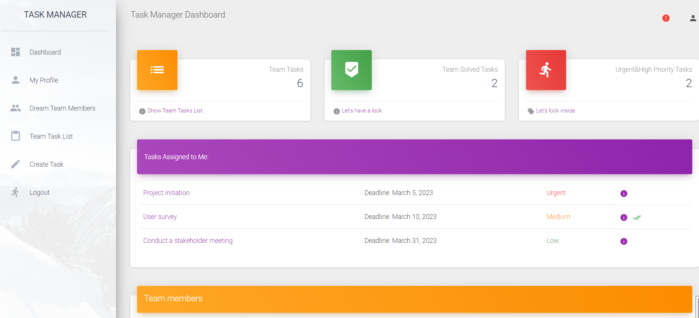

# IT-project-task-manager

Django project for managing tasks of it-team

## Checkit out!

[IT-project-task-manager deployed to render.com](https://it-task-manager-sdp7.onrender.com/)

```
username: test_user
password: worker_test!
```

## Installation

Python3 must be already installed.

```shell
git clone https://github.com/MykytaMoshchenko/IT-project-task-manager.git
cd it_project_task_manager
python3 -m venv venv
source venv/bin/activate
pip install -r requirements.txt
python manage.py runserver
```


## Features

* Managing tasks directly from the website, creating tasks, assigning team members.
* Powerful admin panel for advanced managing


## Demo


